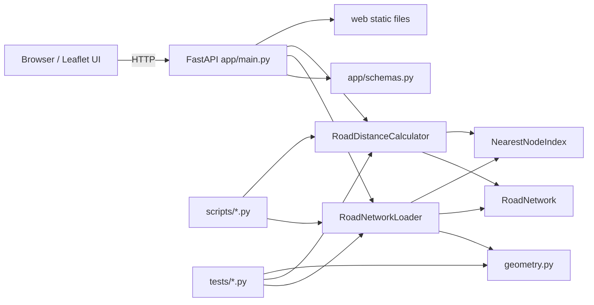
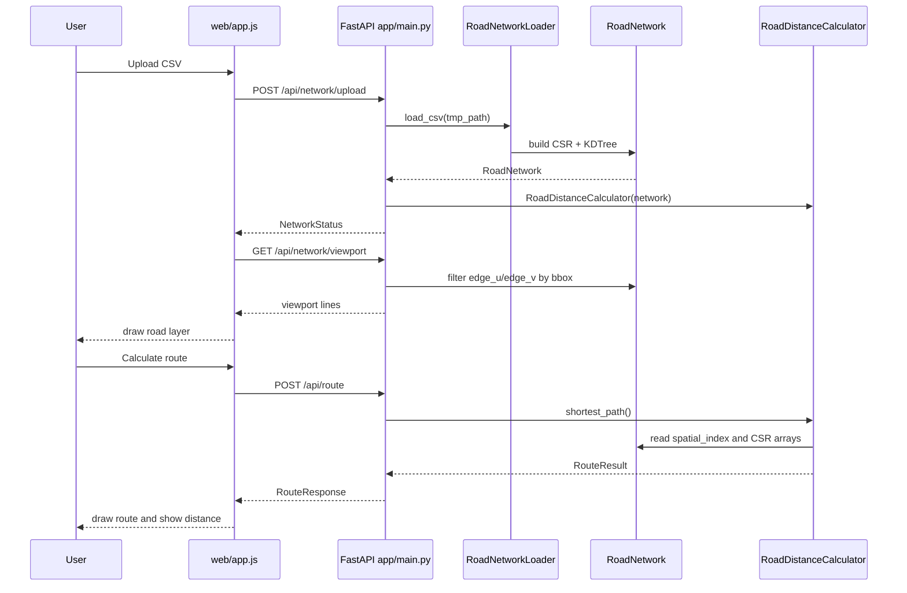
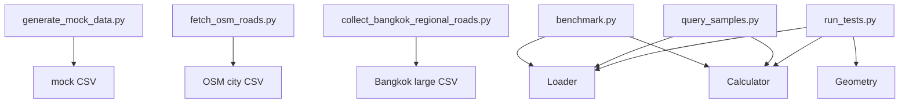

# Road Network Calculator 代码架构与调用关系

本文梳理 `road_network_calculator` 项目的模块职责、调用关系、服务启动后的调用栈，以及前后端数据输入输出接口。

## 1. 项目目录结构

```text
road_network_calculator/
  app/
    main.py             FastAPI 服务入口与 HTTP 接口
    schemas.py          API 请求/响应数据模型
  road_network/
    geometry.py         WKT 解析、经纬度距离计算、坐标转换
    graph.py            RoadNetwork 图数据结构
    loader.py           CSV/WKT 路网加载器
    spatial_index.py    最近路网节点索引
    calculator.py       路网最短路计算器
  web/
    index.html          前端页面结构
    styles.css          前端样式
    app.js              地图、上传、查询、批量、历史记录逻辑
  scripts/
    generate_mock_data.py              生成 mock 网格路网
    fetch_osm_roads.py                 下载 OSM 城市路网
    collect_bangkok_regional_roads.py  采集 Bangkok 大区域边级路网
    benchmark.py                       加载和寻路性能测试
    query_samples.py                   样例点查询测试
    run_tests.py                       轻量核心测试
  tests/
    test_geometry.py
    test_loader.py
    test_calculator.py
    test_api.py
  data/
    *.csv               mock、OSM、小型样例数据
  docs/
    *.md                设计、性能、算法和架构文档
```

## 2. 总体架构图



## 3. 核心模块职责

### 3.1 `app/main.py`

FastAPI 服务入口，负责：

- 返回首页 `web/index.html`。
- 挂载 `/static` 静态资源。
- 接收 CSV 上传。
- 调用 `RoadNetworkLoader` 加载路网。
- 创建全局 `RoadDistanceCalculator`。
- 提供单条路由、批量路由、路网状态、路网图层接口。

全局运行态对象：

```python
_network = None
_calculator = None
MAX_SNAP_DISTANCE_M = 1000.0
```

`_network` 保存当前已加载路网，`_calculator` 基于该路网执行最短路查询。

### 3.2 `app/schemas.py`

定义 API 请求和响应模型：

- `RouteRequest`
- `RouteResponse`
- `BatchRouteRequest`
- `BatchRouteResponse`
- `NetworkStatus`
- `NetworkPreview`
- `NetworkViewport`

这些模型用于 FastAPI 自动校验请求参数，并生成 `/docs` 接口文档。

### 3.3 `road_network/loader.py`

核心类：

```python
RoadNetworkLoader
```

职责：

- 读取 CSV。
- 识别 `WKT` 或 `wkt` 列。
- 解析 `LINESTRING`。
- 对坐标节点去重。
- 拆分相邻点为无向边。
- 计算边长。
- 构建 CSR 图结构。
- 构建最近节点空间索引。
- 生成 `RoadNetwork`。

### 3.4 `road_network/graph.py`

核心数据结构：

```python
RoadNetwork
```

内部主要字段：

```text
node_lons     节点经度数组
node_lats     节点纬度数组
offsets       CSR 邻接偏移数组
neighbors     CSR 邻居节点数组
weights       CSR 边权重数组
edge_u        无向边起点数组
edge_v        无向边终点数组
spatial_index 最近节点索引
metadata      加载耗时、边界范围等元数据
```

### 3.5 `road_network/spatial_index.py`

核心类：

```python
NearestNodeIndex
```

职责：

- 将经纬度近似投影到本地米制平面坐标。
- 优先使用 `scipy.spatial.cKDTree` 建立最近邻索引。
- 查询输入经纬度最近的路网节点。

### 3.6 `road_network/calculator.py`

核心类：

```python
RoadDistanceCalculator
```

职责：

- 起终点吸附到最近路网节点。
- 校验最大吸附距离，当前为 1000m。
- 执行双向 Dijkstra。
- 返回最短距离、路径坐标、吸附点、耗时。

### 3.7 `web/app.js`

前端主逻辑：

- 初始化 Leaflet 地图。
- 上传 CSV。
- 调用路由 API。
- 批量解析输入。
- 展示历史查询。
- 调用 `/api/network/viewport` 按当前视野加载路网图层。
- 支持中英文切换。

## 4. 代码依赖关系图

```mermaid
flowchart TD
  main[app/main.py]
  schemas[app/schemas.py]
  init[road_network/__init__.py]
  loader[road_network/loader.py]
  calculator[road_network/calculator.py]
  graph[road_network/graph.py]
  geometry[road_network/geometry.py]
  spatial[road_network/spatial_index.py]
  webjs[web/app.js]
  html[web/index.html]

  html --> webjs
  webjs -->|fetch API| main

  main --> schemas
  main --> init
  init --> loader
  init --> calculator
  init --> graph

  loader --> geometry
  loader --> graph
  loader --> spatial

  graph --> spatial
  spatial --> geometry
  calculator --> graph
```

## 5. 服务启动后的调用栈

启动命令：

```powershell
python -m uvicorn app.main:app --host 127.0.0.1 --port 8000
```

启动调用关系：

```text
uvicorn
  -> import app.main:app
    -> 创建 FastAPI app
    -> 添加 CORS middleware
    -> 挂载 /static 到 web/
    -> 注册 API route
    -> 初始化全局变量 _network=None, _calculator=None
```

此时路网还没有加载。

浏览器访问：

```text
GET /
```

调用栈：

```text
Browser
  -> GET /
    -> app.main.index()
      -> FileResponse(web/index.html)
        -> Browser 加载 /static/styles.css
        -> Browser 加载 /static/app.js
        -> web/app.js 初始化 Leaflet 地图
        -> web/app.js 调用 GET /api/network/status
```

## 6. 路网上传调用栈

前端动作：

```text
选择 CSV -> 点击 Upload and Load
```

HTTP 请求：

```http
POST /api/network/upload
Content-Type: multipart/form-data
file=<csv>
```

调用栈：

```text
web/app.js uploadNetwork()
  -> fetch("/api/network/upload")
    -> app.main.upload_network()
      -> 保存 UploadFile 到临时 CSV
      -> RoadNetworkLoader().load_csv(tmp_path)
        -> csv.DictReader
        -> _find_wkt_field()
        -> parse_linestring_wkt()
        -> _get_or_create_node()
        -> haversine_m()
        -> _build_csr()
        -> NearestNodeIndex()
          -> scipy.spatial.cKDTree
        -> return RoadNetwork
      -> _network = network
      -> _calculator = RoadDistanceCalculator(network)
      -> return NetworkStatus
```

响应数据：

```json
{
  "loaded": true,
  "nodes": 97016,
  "edges": 103865,
  "metadata": {
    "load_time_ms": 1172.02,
    "raw_edge_count": 103898,
    "invalid_rows": 0,
    "min_lon": 100.4535303,
    "min_lat": 13.3842836,
    "max_lon": 101.5223286,
    "max_lat": 14.807199
  }
}
```

前端收到后：

```text
保存 networkLoaded=true
保存 networkBounds
fitNetworkBounds()
scheduleNetworkPreviewLoad()
```

## 7. 路网图层局部加载调用栈

触发时机：

- 上传路网后。
- 地图移动结束。
- 地图缩放结束。
- 点击 Refresh Layer。
- 修改最大线段数后。

HTTP 请求：

```http
GET /api/network/viewport?west=...&south=...&east=...&north=...&limit=12000
```

调用栈：

```text
web/app.js scheduleNetworkPreviewLoad()
  -> loadNetworkPreview()
    -> map.getBounds()
    -> fetch("/api/network/viewport?...bbox...")
      -> app.main.network_viewport()
        -> 读取 _network.edge_u / _network.edge_v
        -> 取边两端节点经纬度
        -> NumPy 向量化 bbox 过滤
        -> _sample_indices()
        -> _edge_indices_to_lines()
        -> return NetworkViewport
    -> drawNetworkPreview()
      -> networkLayer.clearLayers()
      -> requestAnimationFrame 分批画 polyline
```

响应数据：

```json
{
  "total_edges": 103865,
  "matched_edges": 26028,
  "returned_edges": 12000,
  "bounds": {
    "west": 100.49,
    "south": 13.74,
    "east": 100.55,
    "north": 13.77
  },
  "lines": [
    [[100.5262632, 13.7532275], [100.5246435, 13.753501]]
  ]
}
```

## 8. 单条路由查询调用栈

前端动作：

```text
输入起点终点 -> 点击 Calculate Route
```

HTTP 请求：

```http
POST /api/route
Content-Type: application/json
```

请求体：

```json
{
  "start_lon": 100.5418,
  "start_lat": 13.7306,
  "end_lon": 100.5502,
  "end_lat": 13.7999
}
```

调用栈：

```text
web/app.js calculateRoute()
  -> requestRoute()
    -> fetch("/api/route")
      -> app.main.route()
        -> _calculator.shortest_path(..., max_snap_distance_m=1000)
          -> spatial_index.query(start)
          -> spatial_index.query(end)
          -> 如果吸附距离 > 1000m，返回不可达
          -> _bidirectional_dijkstra(start_node, end_node)
            -> heapq pop
            -> _relax()
              -> 遍历 CSR offsets/neighbors/weights
            -> _scan_cross()
            -> _reconstruct_path()
          -> return RouteResult
        -> 转换为 RouteResponse
```

响应体：

```json
{
  "distance_m": 9149.1,
  "path": [[100.5418, 13.7306], [100.5421, 13.7310]],
  "snapped_start": [100.5418, 13.7306],
  "snapped_end": [100.5502, 13.7999],
  "timings_ms": {
    "snap": 0.25,
    "search": 280.98,
    "total": 281.47
  },
  "reachable": true,
  "snap_start_distance_m": 23.5,
  "snap_end_distance_m": 13.8
}
```

前端收到后：

```text
renderRoute()
  -> 更新距离和耗时
  -> 绘制 snapped start marker
  -> 绘制 snapped end marker
  -> 绘制蓝色路径 polyline
saveHistory()
  -> 写入 localStorage
```

## 9. 批量路由查询调用栈

前端输入：

```text
100.491389 13.75 100.53485 13.7465
100.5418 13.7306 100.5502 13.7999
```

HTTP 请求：

```http
POST /api/routes/batch
Content-Type: application/json
```

请求体：

```json
{
  "routes": [
    {
      "start_lon": 100.491389,
      "start_lat": 13.75,
      "end_lon": 100.53485,
      "end_lat": 13.7465
    }
  ]
}
```

调用栈：

```text
web/app.js runBatch()
  -> parseBatchInput()
  -> fetch("/api/routes/batch")
    -> app.main.batch_route()
      -> for each RouteRequest
        -> _calculator.shortest_path()
        -> 构造 BatchRouteItem
      -> return BatchRouteResponse
  -> renderBatchResults()
```

响应体：

```json
{
  "results": [
    {
      "index": 0,
      "ok": true,
      "error": "",
      "route": {
        "start_lon": 100.491389,
        "start_lat": 13.75,
        "end_lon": 100.53485,
        "end_lat": 13.7465
      },
      "result": {
        "distance_m": 5053.3,
        "path": [],
        "snapped_start": [100.4913, 13.75],
        "snapped_end": [100.5348, 13.7465],
        "timings_ms": {
          "snap": 0.3,
          "search": 68.7,
          "total": 69.2
        },
        "reachable": true,
        "snap_start_distance_m": 21.9,
        "snap_end_distance_m": 81.4
      }
    }
  ]
}
```

点击批量结果项后：

```text
writeRouteInputs()
renderRoute()
saveHistory()
```

## 10. 吸附失败调用栈

触发条件：

```text
起点或终点距离最近路网节点超过 1000m
```

调用栈：

```text
RoadDistanceCalculator.shortest_path()
  -> spatial_index.query(start)
  -> spatial_index.query(end)
  -> snap distance check
  -> 不执行 _bidirectional_dijkstra()
  -> return reachable=False

app.main.route()
  -> 判断 snap_start_distance_m / snap_end_distance_m
  -> raise HTTPException(400)
```

错误响应：

```json
{
  "detail": "Start or end point is more than 1000m from the loaded road network. Routing cannot continue."
}
```

前端：

```text
requestRoute()
  -> throw Error
calculateRoute()
  -> localizeError()
  -> setStatus()
```

## 11. 数据流总览



## 12. 主要 API 清单

| 方法 | 路径 | 作用 | 主要输入 | 主要输出 |
| --- | --- | --- | --- | --- |
| `GET` | `/` | 返回首页 | 无 | `index.html` |
| `GET` | `/api/network/status` | 查询路网加载状态 | 无 | `NetworkStatus` |
| `POST` | `/api/network/upload` | 上传并加载 CSV 路网 | multipart CSV file | `NetworkStatus` |
| `GET` | `/api/network/preview` | 全图抽样路网预览 | `limit` | `NetworkPreview` |
| `GET` | `/api/network/viewport` | 当前视野局部路网 | `west/south/east/north/limit` | `NetworkViewport` |
| `POST` | `/api/route` | 单条最短路计算 | `RouteRequest` | `RouteResponse` |
| `POST` | `/api/routes/batch` | 批量最短路计算 | `BatchRouteRequest` | `BatchRouteResponse` |

## 13. 前端状态存储

前端使用浏览器 `localStorage` 保存：

```text
roadNetworkRouteHistory   最近 30 条成功查询记录
roadNetworkLanguage       当前界面语言
```

不会写入后端数据库。

## 14. 脚本与核心模块调用关系



说明：

- 数据生成脚本只负责生成 CSV。
- 性能和查询脚本复用正式的 `RoadNetworkLoader` 和 `RoadDistanceCalculator`。
- 测试脚本与 Web 服务共用同一套算法核心。

## 15. 当前架构特点

优点：

- 算法核心与 Web 服务解耦。
- 前端只通过 HTTP API 与后端交互。
- 路网加载后驻留内存，查询无需重复解析 CSV。
- CSR 图结构适合百万级路网。
- 视野路网接口避免前端一次性渲染全量道路。

限制：

- 当前服务只维护一个全局 `_network`，同一时刻只支持一个已加载路网。
- 路网加载在请求线程内完成，大文件上传期间接口会被占用。
- 长距离查询仍基于双向 Dijkstra，超大路网下 30km+ 查询可能超过 1 秒。
- 历史查询只存浏览器本地，不跨浏览器或跨设备同步。

## 16. 后续可演进方向

- 多路网管理：引入 network id，支持多份路网并存。
- 后台加载任务：上传后异步构建路网，前端轮询状态。
- 路网持久化：将 CSR 和 KDTree 序列化，避免每次启动重新解析 CSV。
- 更快寻路：实现 A*、ALT landmarks 或 Contraction Hierarchies。
- 瓦片化路网图层：进一步优化前端大规模可视化。

