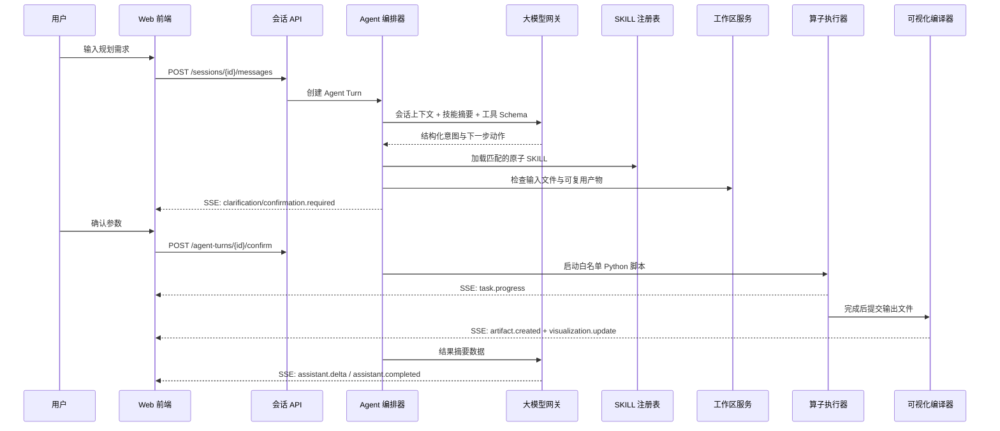
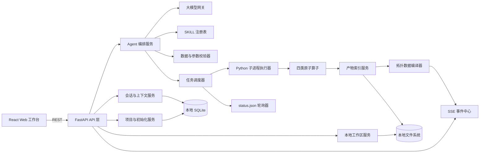

# 智能规划助手技术架构与开发方案

## 1. 设计目标

面向单用户、本地 Windows 服务器部署，建设一个由自然语言驱动的规划工作台。产品名称统一为“智能规划助手”，使用 `CoNET` 英文艺术字体作为品牌图标。平台需要同时管理项目、会话、工作区文件、SKILL、大模型、Python 算子任务及 GIS/逻辑拓扑，并保证所有文件和任务结果保存在本地服务器。

产品数据层级固定为：

```text
项目 Project
└── 会话 Session
    ├── 独立工作空间
    ├── 独立对话上下文
    ├── 独立任务与算子产物
    └── 独立 GIS/逻辑拓扑及 VisualState
```

不同项目独立维护历史会话；同一项目中的不同会话也不共享工作区、任务结果和可视化状态。跨会话或跨项目复用数据必须通过显式复制或导入操作完成。

首版的核心原则：

1. 大模型负责理解、规划、参数提取、过程解释，不负责执行确定性拓扑计算。
2. Python 算子通过白名单适配器启动，禁止大模型生成任意 Shell 命令。
3. Agent 使用显式状态机推进任务，关键参数和高风险动作需要用户确认。
4. 长时间算子与 HTTP 请求解耦，使用任务记录、后台进程和事件流反馈进度。
5. GIS 与逻辑拓扑共享统一数据模型、过滤规则和样式状态。
6. 所有文件访问限制在当前会话工作区，文件打开接口只允许调用工作区内的白名单文件类型。
7. 产品首次启动必须完成项目名称初始化，完成后才能进入主工作台。

## 2. Agent 对话机制

### 2.1 Agent 在系统中的职责

Agent 不是一个单纯的聊天机器人，而是会话状态与业务工具之间的编排层。它负责：

- 判断用户是在咨询、执行规划、补充数据、确认参数，还是控制可视化。
- 根据意图选择顶层编排技能及对应原子能力。
- 读取原子能力的输入要求、参数、启动方式和输出契约。
- 检查当前工作区是否已有可复用输入与前序任务结果。
- 将缺失信息转换成用户可理解的问题。
- 生成结构化参数草案并等待用户确认。
- 调用白名单 Python 算子、监控 `status.json`、归档输出产物。
- 把结果转换为对话消息、统计报告和拓扑可视化数据。

### 2.2 一次对话的完整链路



### 2.3 大模型接入方式

浏览器不保存密钥，也不直接访问模型。后端提供统一的 `ModelGateway`，再通过不同 Provider 适配器接入企业内模型或公有云模型。

推荐首版优先支持 OpenAI-compatible 接口，配置示例：

```text
MODEL_PROVIDER=openai_compatible
MODEL_BASE_URL=http://model-gateway.company.local/v1
MODEL_API_KEY=由服务器安全保存
MODEL_NAME=企业批准的模型名称
MODEL_TIMEOUT_SECONDS=120
```

模型网关需要支持：

- 普通对话与流式输出。
- JSON Schema 结构化输出。
- Tool Calling；模型不支持时使用“生成 JSON + Pydantic 校验 + 一次修复重试”的兼容模式。
- 超时、限流、重试、取消和调用审计。
- 模型能力探测，如上下文长度、是否支持工具调用和流式响应。

首版可使用一个模型完成路由、规划和回答；后续可拆为低成本意图模型与高能力规划模型。

### 2.4 结构化决策而非自由文本解析

Agent 要求模型返回如下结构，而不是从自然语言回答中猜测下一步：

```json
{
  "action": "clarify | confirm | execute | visualize | answer",
  "intent": "ring_chain_identify",
  "skill_ids": ["ring_chain_identify"],
  "required_inputs": ["device.csv", "link.csv"],
  "missing_inputs": [],
  "parameters": {"max_hops": 15},
  "visual_command": null,
  "user_message": "输入数据校验通过，需要确认环链识别参数。"
}
```

后端必须再次校验 `action`、技能 ID、参数范围和文件路径。模型返回的脚本路径、命令行和文件路径不能直接执行。

### 2.5 Agent 状态机

```text
IDLE
  -> INTENT_IDENTIFIED
  -> WAITING_FOR_DATA
  -> VALIDATING_INPUT
  -> WAITING_FOR_CONFIRMATION
  -> READY_TO_RUN
  -> RUNNING
  -> POST_PROCESSING
  -> RESULT_READY
  -> VISUALIZING

任意执行态 -> RECOVERING -> RUNNING / FAILED
用户取消 -> CANCELLED
```

状态写入本地数据库。页面刷新或服务重启后，Agent 可以从任务记录、PID 和 `status.json` 恢复，而不是依赖浏览器内存。

### 2.6 两类用户指令必须分流

1. **规划计算指令**：例如“做环链识别”“继续拓扑优化”，需要进入 SKILL 与算子执行流程。
2. **视图控制指令**：例如“展示以 XX 为根的环”，只生成 `VisualCommand`，不启动 Python 算子。

视图指令示例：

```json
{
  "action": "apply_filter",
  "view": "gis",
  "join": "and",
  "rules": [
    {"field": "root", "operator": "equals", "value": "ASG-BKK-13"},
    {"field": "category", "operator": "equals", "value": "Ring"}
  ],
  "locate": "ASG-BKK-13"
}
```

前端只执行定义过的动作和字段，禁止模型下发 JavaScript。

## 3. 总体技术架构



### 3.1 技术选型建议

| 层级 | 推荐方案 | 选择原因 |
|---|---|---|
| Web 前端 | React + TypeScript + Vite | 组件化、状态管理和复杂工作台生态成熟 |
| 后端 API | FastAPI + Pydantic | 与现有 Python 算子同语言，适合结构化接口和 SSE |
| 会话与元数据 | SQLite | 单用户本地部署足够可靠，支持事务和恢复，数据库本身是本地文件 |
| 文件与产物 | 本地文件系统 | 符合当前部署约束，便于算子直接读取 |
| 实时事件 | SSE | 聊天增量、进度、产物事件均为服务端单向推送，简单且易恢复 |
| GIS | MapLibre GL JS，或首版复用 Leaflet | MapLibre 更适合深色底图和大规模 WebGL 渲染；Leaflet 复用成本低 |
| 逻辑拓扑 | 复用现有布局坐标，Canvas/WebGL 渲染 | 服务端只计算坐标，前端负责缩放、筛选、样式和拾取 |
| 进程执行 | `subprocess.Popen` + Windows 无窗口标志 | 直接适配现有 Python 启动脚本，支持 PID、取消和恢复 |

以上前端、后端和地图组件均属于待引入三方依赖，进入开发前需要完成公司开源软件与许可证评审。架构通过适配器隔离地图和模型供应商，避免核心业务被某一组件锁定。

### 3.2 产品启动与项目初始化

正式版本由 Windows 用户会话中的 Launcher 启动 FastAPI，并由 FastAPI 托管前端构建产物。启动顺序如下：

```text
启动 Launcher
  -> 检查配置、数据库、工作区和算子环境
  -> 启动 FastAPI
  -> GET /api/v1/bootstrap
  -> 未初始化：展示项目命名界面
  -> 创建项目和首个会话工作区
  -> 已初始化：恢复上次活动项目与会话
  -> 打开四列主工作台
```

项目名称不是全局产品名称。产品名称固定为“智能规划助手”，项目名称由用户首次启动时填写，并在右上角展示。后续新建项目时重复执行项目级初始化，但不重复执行产品级环境初始化。

## 4. 后端模块设计

### 4.1 推荐代码结构

```text
backend/
├── app/
│   ├── api/                  # REST 与 SSE 路由
│   ├── agent/                # 状态机、上下文、规划器
│   ├── domain/               # 领域模型和枚举
│   ├── services/
│   │   ├── projects/         # 首次初始化、项目切换、项目级数据边界
│   │   ├── workspace/        # 文件树、上传、重命名、回收站、默认应用打开
│   │   ├── skills/           # 注册、解析、启停、版本
│   │   ├── tasks/            # 启动、轮询、取消、恢复
│   │   ├── artifacts/        # 结果识别与索引
│   │   └── visualization/    # topology.json 与过滤字段编译
│   ├── adapters/
│   │   ├── models/           # 不同模型供应商适配器
│   │   ├── skills/           # 四个原子能力适配器
│   │   └── topology/         # logic_topo_visual.py 适配器
│   ├── persistence/          # SQLite Repository
│   └── main.py
├── tests/
└── migrations/

frontend/
├── src/
│   ├── modules/projects/
│   ├── modules/history/
│   ├── modules/workspace/
│   ├── modules/skills/
│   ├── modules/models/
│   ├── modules/chat/
│   ├── modules/tasks/
│   └── modules/visualization/
└── public/
```

### 4.2 SKILL 注册表

不能只依赖 Markdown 中的相对路径。注册表维护稳定技能 ID 与实际部署信息：

```json
{
  "skill_id": "ring_chain_identify",
  "skill_file": "ring_chain_identify/SKILL.md",
  "working_directory": "D:/approved-operators/ring_chain_identify",
  "entrypoint": "script/run_ring_chain_identify.py",
  "params_file": "params.json",
  "status_file": "status.json",
  "enabled": true,
  "version": "1.0.0"
}
```

当前顶层 SKILL 中的 `atomic_capability_library/...` 与实际四个目录不一致，应在开发前统一修正，或由注册表显式覆盖。

### 4.3 统一原子能力接口

```text
SkillAdapter
  get_manifest() -> SkillManifest
  validate_inputs(workspace) -> ValidationReport
  build_parameter_draft(user_context) -> ParameterDraft
  validate_parameters(params) -> ValidationReport
  prepare_run(task_context) -> RunSpec
  start(run_spec) -> ProcessHandle
  read_status(task_context) -> NormalizedTaskStatus
  discover_artifacts(task_context) -> list[ArtifactRef]
  build_statistics(artifacts, dimensions) -> StatisticsResult
```

四个技能只实现差异部分。状态码 `8001` 至 `8004` 在适配器中统一转换为平台状态，前端不感知算子内部格式。

### 4.4 算子执行安全边界

- 技能注册表中的入口脚本必须在管理员白名单中。
- 使用参数数组启动子进程，不使用 `shell=True`。
- 输入、输出、临时目录使用解析后的绝对路径，并验证属于当前工作区。
- 每个任务记录 PID、启动时间、退出码、技能版本、参数快照和输入文件哈希。
- 以 10 秒为默认周期轮询 `status.json`，仅在进度跨越阈值或阶段变化时发送事件。
- 无业务超时，但保留用户取消、进程失联检测和服务重启恢复机制。
- 自动修复仅允许调用注册过的数据修复器，不能让大模型生成并直接执行任意代码。

## 5. 工作区与产物模型

### 5.1 推荐目录

```text
workspace/
└── projects/{project_id}/
    ├── project.json                 # 项目名称、创建时间和项目配置
    └── sessions/{session_id}/
        ├── uploads/                 # 当前会话原始上传，只读保护
        ├── runs/{task_id}/
        │   ├── input/
        │   ├── output/
        │   ├── temp/
        │   ├── params.snapshot.json
        │   └── run.manifest.json
        ├── visualization/
        │   ├── topology.json
        │   └── visual-state.json
        └── reports/
```

不要让不同项目、不同会话或多个算子直接修改同一个输入目录。多能力编排时，每个任务使用独立 `input/output/temp`，通过 ArtifactRef 和转换任务显式传递数据。会话切换时，前端必须整体切换对话、文件树、活动任务、拓扑数据集和 VisualState。

### 5.2 文件默认应用打开

接口只在本地 Windows 部署时启用：

1. 前端提交当前工作区相对路径。
2. 后端解析为绝对路径并验证路径未越过会话工作区。
3. 校验扩展名在 CSV、XLSX、JSON、Markdown 等允许列表中。
4. 使用 `os.startfile(resolved_path)` 调用 Windows 默认应用。
5. 写入操作审计；接口不返回文件内容。

远程部署时应禁用该能力，改为下载文件。

## 6. 可视化数据设计

### 6.1 统一拓扑数据契约

复用 `logic_topo_visual.py` 的 `export_topology_json()`，但建议输出标准化为：

```json
{
  "schema_version": "1.0",
  "dataset_id": "topo-task-042-solution-0",
  "nodes": [{
    "id": "ASG-BKK-13",
    "role": "ASG",
    "subnet_id": "Subnet-018",
    "longitude": 100.61,
    "latitude": 13.756,
    "logic": {"x": 636, "y": 171},
    "attributes": {"risk": "High", "life_cycle": "live"}
  }],
  "links": [{
    "id": "link-001",
    "source": "ASG-BKK-13",
    "target": "CSG-0474",
    "attributes": {"category": "Ring", "solution_id": "Solution_0"}
  }],
  "filter_schema": {},
  "statistics": {}
}
```

GIS 直接使用经纬度；逻辑拓扑使用服务端生成的 `logic.x/y`。过滤和样式仅改变前端 `VisualState`，不修改原始数据集。

### 6.2 产物自动识别

产物识别采用确定性规则：文件名规则 + 列 Schema 验证，而不是只让大模型猜测文件用途。

- 设备候选：包含网元名称、角色、经纬度或逻辑坐标。
- 链路候选：包含源网元和宿网元。
- 环链结果：包含 Category、Root1、Root2、Member_path。
- 多方案结果：包含 Solution-ID。

识别完成后由拓扑编译器生成 `topology.json`，并发送 `visualization.update` 事件。

## 7. 外部 REST 与事件接口

### 7.1 项目初始化与项目管理

| 方法 | 路径 | 用途 |
|---|---|---|
| GET | `/api/v1/bootstrap` | 查询产品是否已初始化及当前项目 |
| POST | `/api/v1/bootstrap/projects` | 首次启动创建项目并完成初始化 |
| GET | `/api/v1/projects` | 获取项目列表 |
| POST | `/api/v1/projects` | 新建独立项目 |
| GET | `/api/v1/projects/{project_id}` | 获取项目及其会话摘要 |
| PATCH | `/api/v1/projects/{project_id}` | 重命名或修改项目配置 |
| POST | `/api/v1/projects/{project_id}/activate` | 切换当前项目 |

`GET /api/v1/bootstrap` 返回未初始化时，前端只能显示项目初始化界面，不加载主工作台。项目创建成功后返回 `project_id` 和首个 `session_id`。

### 7.2 会话与 Agent

| 方法 | 路径 | 用途 |
|---|---|---|
| POST | `/api/v1/projects/{project_id}/sessions` | 在指定项目中新建独立会话与工作区 |
| GET | `/api/v1/projects/{project_id}/sessions` | 获取指定项目的历史会话列表 |
| GET | `/api/v1/sessions/{id}` | 会话、当前任务和活动数据集 |
| POST | `/api/v1/sessions/{id}/messages` | 发送用户消息，返回 turn_id |
| GET | `/api/v1/sessions/{id}/events` | SSE：模型增量、确认、进度、产物和视图更新 |
| POST | `/api/v1/agent-turns/{id}/confirm` | 确认参数或计划 |
| POST | `/api/v1/agent-turns/{id}/reject` | 拒绝并携带修改意见 |

发送消息响应不等待模型和算子完成：

```json
{"message_id": "msg-001", "turn_id": "turn-001", "status": "accepted"}
```

### 7.3 工作区

| 方法 | 路径 | 用途 |
|---|---|---|
| GET | `/api/v1/projects/{project_id}/sessions/{session_id}/workspace/tree` | 获取当前会话目录树 |
| POST | `/api/v1/projects/{project_id}/sessions/{session_id}/workspace/files` | `multipart/form-data` 连续上传 |
| POST | `/api/v1/projects/{project_id}/sessions/{session_id}/workspace/folders` | 新建文件夹 |
| PATCH | `/api/v1/projects/{project_id}/sessions/{session_id}/workspace/entries/{entry_id}` | 重命名或移动 |
| DELETE | `/api/v1/projects/{project_id}/sessions/{session_id}/workspace/entries/{entry_id}` | 移入回收站 |
| POST | `/api/v1/projects/{project_id}/sessions/{session_id}/workspace/entries/{entry_id}/open` | 本机默认应用打开 |
| GET | `/api/v1/projects/{project_id}/sessions/{session_id}/workspace/entries/{entry_id}/download` | 下载文件 |

### 7.4 SKILL 与模型

| 方法 | 路径 | 用途 |
|---|---|---|
| GET | `/api/v1/skills` | 技能列表、状态和版本 |
| GET | `/api/v1/skills/{id}` | 输入、参数和输出摘要 |
| PATCH | `/api/v1/skills/{id}` | 启停技能 |
| POST | `/api/v1/skills/{id}/validate` | 校验当前工作区输入 |
| GET | `/api/v1/models` | 已配置模型列表，不返回密钥 |
| POST | `/api/v1/models/test` | 测试模型连接与能力 |
| PATCH | `/api/v1/models/default` | 切换默认模型 |

### 7.5 任务与可视化

| 方法 | 路径 | 用途 |
|---|---|---|
| GET | `/api/v1/tasks/{id}` | 获取任务快照 |
| POST | `/api/v1/tasks/{id}/cancel` | 取消运行中的任务 |
| POST | `/api/v1/tasks/{id}/retry` | 使用参数快照重试 |
| GET | `/api/v1/datasets/{id}/topology` | 获取统一拓扑数据 |
| POST | `/api/v1/datasets/{id}/commands` | 保存或执行结构化视图命令 |
| PUT | `/api/v1/datasets/{id}/visual-state` | 保存筛选和样式状态 |
| GET | `/api/v1/datasets/{id}/visual-state` | 恢复筛选和样式状态 |

### 7.6 SSE 事件信封

```json
{
  "event_id": "evt-1001",
  "type": "task.progress",
  "session_id": "session-001",
  "turn_id": "turn-001",
  "task_id": "task-042",
  "timestamp": "2026-08-03T16:00:00+08:00",
  "payload": {"progress": 72, "stage": "正在整理环链结果"}
}
```

事件类型至少包括：

- `assistant.delta`、`assistant.completed`
- `agent.plan`
- `confirmation.required`
- `task.started`、`task.progress`、`task.completed`、`task.failed`
- `artifact.created`
- `visualization.update`
- `workspace.changed`

客户端使用 `Last-Event-ID` 断线续传，页面刷新后先获取会话快照，再继续订阅事件。

## 8. 核心内部接口

```text
ModelProvider
  stream_chat(request) -> AsyncIterator[ModelChunk]
  structured_chat(request, schema) -> StructuredResult
  test_connection() -> ModelCapability

AgentOrchestrator
  handle_turn(turn_id) -> None
  confirm_turn(turn_id, confirmation) -> None
  resume_session(session_id) -> None

ProjectService
  bootstrap(project_name) -> ProjectSnapshot
  create_project(project_name) -> ProjectSnapshot
  activate_project(project_id) -> ProjectSnapshot
  rename_project(project_id, project_name) -> Project

WorkspaceService
  list_tree(project_id, session_id) -> WorkspaceTree
  save_uploads(project_id, session_id, files, target) -> list[WorkspaceEntry]
  resolve_safe_path(project_id, session_id, entry_id) -> Path
  open_with_default_app(entry_id) -> None

TaskService
  create_task(run_spec) -> TaskRecord
  start(task_id) -> None
  cancel(task_id) -> None
  recover_running_tasks() -> None

ArtifactService
  discover(task_id) -> list[ArtifactRef]
  validate_schema(artifact) -> ValidationReport
  resolve_inputs(skill_id, session_context) -> InputResolution

TopologyCompiler
  compile(device_artifact, link_artifact, result_artifacts) -> TopologyDataset
```

## 9. 数据表建议

首版 SQLite 至少包含：

- `projects`：项目名称、初始化状态、项目配置、创建与更新时间。
- `sessions`：project_id、标题、当前状态、活动数据集、创建与更新时间。
- `messages`：角色、文本、结构化内容、turn_id、时间。
- `agent_turns`：意图、技能、状态、等待确认内容、错误摘要。
- `tasks`：技能、PID、参数、目录、状态、进度、退出码。
- `artifacts`：路径、类型、Schema、哈希、来源任务、是否可视化。
- `events`：事件 ID、类型、载荷，用于 SSE 续传。
- `model_configs`：模型名称、Provider、Base URL、能力；密钥使用系统安全存储或环境变量。
- `skill_configs`：技能 ID、路径、入口、版本、启停状态。
- `visual_states`：数据集对应的过滤、样式、视口和当前选择。

## 10. 开发任务拆解

### 阶段 0：契约与工程基线，3 至 5 人日

- 固化四个 SkillManifest，修正技能路径与入口脚本映射。
- 固化会话、任务、产物、拓扑和事件 Schema。
- 建立前后端工程、配置加载、日志、异常和测试基线。
- 完成公司允许使用的三方组件确认。

验收：四个技能均可通过注册表加载；OpenAPI 与事件类型评审通过。

### 阶段 1：项目、会话与工作区，6 至 8 人日

- 首次启动项目初始化、项目创建、切换和重命名。
- 项目级历史会话隔离。
- 会话创建、切换、历史记录和本地持久化。
- 会话级工作空间、任务结果和可视化状态隔离。
- 文件连续上传、目录树、新建、重命名、移动、回收站。
- Windows 默认应用打开和路径安全校验。
- 工作区变更事件与前端四列布局接入。

验收：未初始化时不能进入主工作台；切换项目只显示该项目的历史会话；切换会话时对话、文件和拓扑同步切换；页面刷新后项目、会话和文件仍存在；无法访问当前会话工作区外路径。

### 阶段 2：模型网关与基础 Agent，7 至 10 人日

- OpenAI-compatible 模型适配器与流式输出。
- 模型配置、连接测试和服务端密钥管理。
- Agent 状态机、上下文构建、结构化意图与 Tool Schema。
- 澄清、参数确认、拒绝修改和会话恢复。
- 视图控制意图与规划计算意图分流。

验收：模型不执行真实脚本也能完成意图识别、数据检查和参数确认闭环；非法工具调用被后端拒绝。

### 阶段 3：SKILL 与算子执行，8 至 12 人日

- 四个 SkillAdapter。
- 输入文件和列 Schema 校验。
- 参数草案、确认快照与参数 JSON 生成。
- Python 子进程启动、PID 管理、取消与恢复。
- `status.json` 轮询、状态归一化和 SSE 进度。
- 输出发现、日志摘要和失败恢复框架。

验收：四个原子能力可独立完成一次真实运行；服务重启后可恢复任务状态。

### 阶段 4：多能力编排与数据转换，6 至 9 人日

- 子网划分与环链识别并行编排。
- 前序产物复用和文件哈希判断。
- 子网划分、环链识别到拓扑优化的数据模型转换器。
- 每步独立目录、转换日志和输入再次校验。
- 新增站点规划内部依赖处理。

验收：可以从原始 device/link 一次完成“子网划分 + 环链识别 + 指定子网拓扑优化”。

### 阶段 5：可视化与自然语言联动，8 至 12 人日

- 结果文件识别与统一 topology.json 编译。
- 接入 `logic_topo_visual.py` 布局结果。
- GIS/逻辑拓扑加载、切换、选中、缩放、全屏。
- 统一过滤、样式、统计和 VisualState 持久化。
- 自然语言到 VisualCommand 的结构化转换。
- 大数据量抽样、视口裁剪或聚合策略。

验收：自然语言“展示以某网元为根的环”不调用算子即可刷新两个视图；刷新页面后保持筛选状态。

### 阶段 6：报告、可观测性与验收，5 至 8 人日

- 统计维度选择、CSV/Markdown 报告生成。
- 操作审计、模型调用指标、任务日志和错误分级。
- 单元、接口、端到端、异常恢复和大数据量性能测试。
- Windows 一键启动、配置检查、工作区备份与升级说明。

验收：核心用户旅程端到端通过，失败任务有可理解提示和可追溯内部日志。

### 工期估算

- 单名全栈工程师：约 8 至 11 周。
- 1 名前端 + 2 名后端/算法集成：约 5 至 7 周。
- 如算子输入输出不稳定、模型接口未确定或需要企业安全审批，应单独预留缓冲。

## 11. 测试重点

1. 模型输出非法技能、非法参数和工作区外路径时必须被拒绝。
2. 上传文件缺列、编码异常、空文件、重复网元和悬空链路时给出正确交互提示。
3. 同一会话连续运行多个任务时，输入输出不能串目录。
4. 服务重启、浏览器刷新、SSE 断线后状态能够恢复。
5. 算子失败、状态文件损坏、进程退出但状态未更新时能够归一化为明确状态。
6. 过滤和样式同时作用于 GIS 与逻辑拓扑，并保持统计一致。
7. 2 万节点规模下验证首屏时间、交互帧率、内存和筛选延迟。

## 12. 开发前必须确认的决策

1. 企业可使用的大模型及其 API 是否兼容 OpenAI 协议、Tool Calling 和流式输出。
2. React、FastAPI、MapLibre/Leaflet 等三方组件是否通过公司开源软件评审。
3. Python 算子的真实项目根目录、入口脚本和依赖环境是否固定。
4. 是否允许服务端调用 `os.startfile()`；若未来远程部署，需要自动降级为下载。
5. 最大预期网元与链路数量，以决定首版采用 Leaflet Canvas 还是直接采用 WebGL 渲染。
6. 算子失败自动修复的允许边界，尤其是否允许自动生成数据转换脚本。
